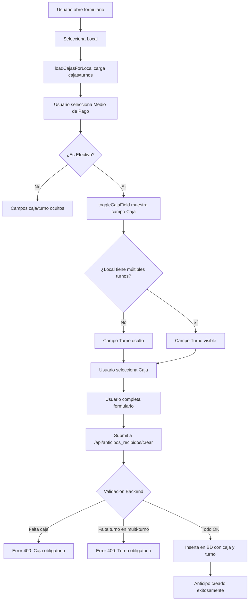
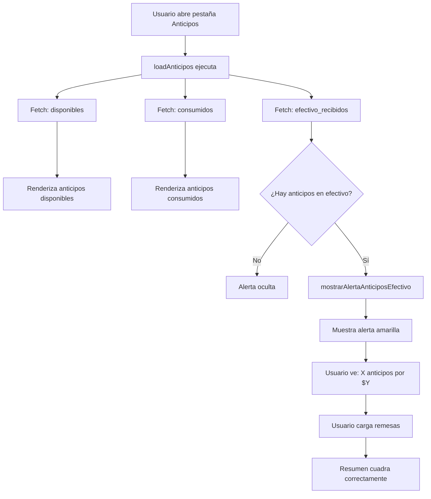

# Implementación: Consistencia Total en Anticipos en Efectivo

## 🎯 Objetivo

Garantizar que los resumenes de caja sean **100% consistentes** eliminando cualquier discrepancia entre:
- Resumen de caja individual
- Resumen local (agregado)
- Diferencias detalladas por caja/turno

---

## ✅ Cambios Implementados

### 1. Validación Estricta en Backend

**Archivo:** `app.py` (líneas ~2680-2720)

**Cambios:**
```python
# Validar si el medio de pago es efectivo
es_efectivo = False
if medio_pago_id:
    cur.execute("SELECT es_efectivo FROM medios_anticipos WHERE id = %s", (medio_pago_id,))
    result = cur.fetchone()
    es_efectivo = (result and result[0] == 1) if result else False

# VALIDACIÓN ESTRICTA: Si es efectivo, caja es OBLIGATORIA
if es_efectivo:
    if not caja:
        return jsonify(
            success=False,
            msg="⚠️  Caja es obligatoria para anticipos en efectivo. Seleccioná la caja que recibió el dinero."
        ), 400

    # Verificar si el local tiene múltiples turnos
    cur.execute("SELECT turnos FROM locales WHERE local = %s LIMIT 1", (local,))
    result = cur.fetchone()
    turnos_del_local = result[0] if result else None

    # Si el local tiene múltiples turnos (contiene coma), el turno es OBLIGATORIO
    if turnos_del_local and ',' in turnos_del_local:
        if not turno:
            return jsonify(
                success=False,
                msg=f"⚠️  Turno es obligatorio para anticipos en efectivo en este local. Seleccioná el turno en que se recibió el dinero."
            ), 400
```

**¿Qué hace?**
1. Verifica si el medio de pago seleccionado es efectivo
2. Si es efectivo → **Caja es OBLIGATORIA**
3. Consulta la configuración del local (campo `turnos`)
4. Si el local tiene múltiples turnos (detecta la coma) → **Turno es OBLIGATORIO**
5. Rechaza la creación del anticipo si falta alguno de estos datos

**Resultado:**
- ✅ IMPOSIBLE crear anticipos en efectivo sin caja
- ✅ IMPOSIBLE crear anticipos en efectivo sin turno (en locales multi-turno)
- ✅ Datos siempre consistentes desde el origen

---

### 2. Frontend Dinámico

**Archivo:** `gestion_anticipos.js` (líneas ~310-365)

**Cambios:**
```javascript
async function loadCajasForLocal(local) {
  const cajaSelect = $('#caja');
  const turnoSelect = $('#turno');
  const cajaGroup = $('#cajaGroup');
  const turnoGroup = $('#turnoGroup');

  // Si no hay local seleccionado, limpiar y ocultar campos
  if (!cajaSelect || !local) {
    if (cajaGroup) cajaGroup.style.display = 'none';
    if (turnoGroup) turnoGroup.style.display = 'none';
    if (cajaSelect) cajaSelect.innerHTML = '<option value="">Seleccione una caja</option>';
    if (turnoSelect) turnoSelect.innerHTML = '<option value="">Seleccione un turno</option>';
    localTieneMultiplesTurnos = false;
    return;
  }

  // Cargar cajas y turnos del local
  const response = await fetch(`/api/locales/${encodeURIComponent(local)}/cajas`);
  const data = await response.json();

  if (data.success && data.cajas) {
    // Cargar opciones de cajas
    cajaSelect.innerHTML = '<option value="">Seleccione una caja</option>';
    data.cajas.forEach(caja => {
      const option = document.createElement('option');
      option.value = caja;
      option.textContent = caja;
      cajaSelect.appendChild(option);
    });

    // Guardar si el local tiene múltiples turnos
    localTieneMultiplesTurnos = data.tiene_multiples_turnos || false;

    // Cargar opciones de turnos
    if (localTieneMultiplesTurnos && data.turnos) {
      turnoSelect.innerHTML = '<option value="">Seleccione un turno</option>';
      data.turnos.forEach(turno => {
        const option = document.createElement('option');
        option.value = turno;
        option.textContent = turno;
        turnoSelect.appendChild(option);
      });
    }

    // Actualizar visibilidad según medio de pago ya seleccionado
    toggleCajaField();
  }
}
```

**¿Qué hace?**
1. Al cambiar el local seleccionado, carga automáticamente:
   - Las cajas disponibles (desde tabla `locales`)
   - Los turnos disponibles (si el local tiene múltiples)
2. Limpia los campos cuando se deselecciona un local
3. Actualiza la visibilidad de los campos según el medio de pago
4. Mantiene sincronizados los datos con la configuración del local

**Resultado:**
- ✅ Los campos se actualizan automáticamente al cambiar local
- ✅ Solo se muestran campos relevantes (caja solo si es efectivo)
- ✅ Solo se muestra turno si el local tiene múltiples turnos
- ✅ UX fluida y sin confusión

---

### 3. Alerta Informativa en Pestaña Anticipos

**Archivo:** `index.html` (líneas ~805-820)

**Agregado:**
```html
<!-- Alerta de anticipos en efectivo recibidos (se muestra dinámicamente) -->
<div id="alerta-anticipos-efectivo" style="display:none; background:#fef3c7; border-left:4px solid #f59e0b; padding:14px 16px; margin-bottom:20px; border-radius:6px;">
  <div style="display:flex; align-items:start; gap:12px;">
    <span style="font-size:24px; flex-shrink:0;">⚠️</span>
    <div style="flex:1;">
      <strong style="color:#92400e; display:block; margin-bottom:6px; font-size:15px;">
        Anticipo(s) en Efectivo Recibido(s)
      </strong>
      <p id="alerta-anticipos-texto" style="color:#78350f; margin:0; font-size:14px; line-height:1.5;">
        <!-- Texto dinámico -->
      </p>
    </div>
  </div>
</div>
```

**Archivo:** `anticipos_v2.js` (líneas ~312-320, 365-395)

**Agregado:**
```javascript
// En loadAnticipos() - agregar fetch de anticipos en efectivo
const urlEfectivoRecibidos = `/api/anticipos/efectivo_recibidos?local=${...}&caja=${...}&fecha=${...}&turno=${...}`;

const [resDisponibles, resConsumidos, resEfectivoRecibidos] = await Promise.all([
  fetch(urlDisponibles),
  fetch(urlConsumidos),
  fetch(urlEfectivoRecibidos)  // NUEVO
]);

// Mostrar alerta
if (dataEfectivoRecibidos.success) {
  mostrarAlertaAnticiposEfectivo(dataEfectivoRecibidos.anticipos || [], dataEfectivoRecibidos.total || 0);
}

// Nueva función para mostrar alerta
function mostrarAlertaAnticiposEfectivo(anticipos, total) {
  const alerta = document.getElementById('alerta-anticipos-efectivo');
  const texto = document.getElementById('alerta-anticipos-texto');

  if (anticipos.length === 0 || total === 0) {
    alerta.style.display = 'none';
    return;
  }

  const montoFormateado = new Intl.NumberFormat('es-AR', {
    minimumFractionDigits: 2,
    maximumFractionDigits: 2
  }).format(total);

  const cantidadTexto = anticipos.length === 1 ? '1 anticipo' : `${anticipos.length} anticipos`;
  const mensaje = `
    Se ${anticipos.length === 1 ? 'ha recibido' : 'han recibido'} <strong>${cantidadTexto}</strong> en efectivo en esta caja el día de hoy,
    por un total de <strong>$${montoFormateado}</strong>.
    <br><br>
    <strong>⚠️ Importante:</strong> Debés cargar ${anticipos.length === 1 ? 'una remesa' : 'remesas'} con este monto en esta caja y turno
    para que el resumen cierre correctamente.
  `;

  texto.innerHTML = mensaje;
  alerta.style.display = 'block';
}
```

**¿Qué hace?**
1. Al abrir la pestaña "Anticipos", consulta los anticipos en efectivo recibidos
2. Si hay anticipos en efectivo, muestra una alerta amarilla prominente
3. Informa al usuario:
   - Cantidad de anticipos recibidos
   - Monto total (incluyendo conversión USD → ARS)
   - Acción requerida: cargar remesas con ese monto
4. La alerta se oculta automáticamente si no hay anticipos

**Resultado:**
- ✅ Usuario siempre informado de anticipos en efectivo pendientes
- ✅ Reducción de errores por olvido de cargar remesas
- ✅ Guía clara de qué hacer para que la caja cuadre

---

### 4. Nuevo Endpoint Backend

**Archivo:** `app.py` (líneas ~3520-3595)

**Agregado:**
```python
@app.route('/api/anticipos/efectivo_recibidos', methods=['GET'])
@login_required
def obtener_anticipos_efectivo_recibidos():
    """
    Obtener anticipos en efectivo recibidos en una caja/turno específico.
    Sirve para alertar al usuario que debe cargar remesas con esos montos.

    Params:
    - local
    - caja
    - fecha (fecha_pago)
    - turno

    Returns:
    {
        "success": true,
        "anticipos": [...],
        "total": 12345.67  # Total en ARS (incluyendo conversión de USD)
    }
    """
    local = get_local_param()
    caja = request.args.get('caja', '').strip()
    fecha = request.args.get('fecha', '').strip()
    turno = request.args.get('turno', 'UNI').strip().upper()

    if not (local and caja and fecha):
        return jsonify(success=False, msg="Local, caja y fecha son requeridos"), 400

    fecha_norm = _normalize_fecha(fecha)
    if not fecha_norm:
        return jsonify(success=False, msg="Formato de fecha inválido"), 400

    try:
        conn = get_db_connection()
        cur = conn.cursor(dictionary=True)

        # Buscar anticipos en efectivo recibidos en esta caja/turno/fecha
        cur.execute("""
            SELECT
                ar.id,
                ar.cliente,
                ar.importe,
                ar.divisa,
                ar.cotizacion_divisa,
                ma.nombre as medio_pago,
                CASE
                    WHEN ar.divisa = 'USD' AND ar.cotizacion_divisa IS NOT NULL
                    THEN ar.importe * ar.cotizacion_divisa
                    WHEN ar.divisa = 'ARS' OR ar.divisa IS NULL
                    THEN ar.importe
                    ELSE ar.importe
                END as importe_ars
            FROM anticipos_recibidos ar
            INNER JOIN medios_anticipos ma ON ar.medio_pago_id = ma.id
            WHERE DATE(ar.fecha_pago) = %s
              AND ar.local = %s
              AND ar.caja = %s
              AND (ar.turno = %s OR ar.turno IS NULL)
              AND ma.es_efectivo = 1
              AND ar.estado != 'eliminado_global'
            ORDER BY ar.created_at DESC
        """, (fecha_norm, local, caja, turno))

        anticipos = cur.fetchall() or []

        # Calcular total
        total = sum(float(a['importe_ars']) for a in anticipos)

        cur.close()
        conn.close()

        return jsonify(
            success=True,
            anticipos=anticipos,
            total=total
        )

    except Exception as e:
        print(f"❌ Error en /api/anticipos/efectivo_recibidos: {e}")
        return jsonify(success=False, msg=f"Error: {str(e)}"), 500
```

**¿Qué hace?**
1. Consulta todos los anticipos en efectivo recibidos para una caja/turno/fecha
2. Incluye conversión automática de USD a ARS
3. Calcula el total que debe coincidir con las remesas
4. Filtra por turno (incluyendo NULL para retrocompatibilidad)
5. Retorna lista completa de anticipos + total

**Resultado:**
- ✅ Fuente única de verdad para alertas
- ✅ Consistente con cálculo de resumen
- ✅ Reutilizable para otros propósitos

---

## 📊 Flujo Completo

### Escenario: Crear Anticipo en Efectivo



### Escenario: Ver Anticipos en Caja



---

## 🧪 Testing

### Test 1: Validación de Caja

**Pasos:**
1. Crear anticipo con medio "Efectivo"
2. NO seleccionar caja
3. Intentar guardar

**Resultado esperado:**
```
❌ Error 400
"⚠️  Caja es obligatoria para anticipos en efectivo. Seleccioná la caja que recibió el dinero."
```

### Test 2: Validación de Turno

**Pasos:**
1. Seleccionar local con múltiples turnos (ej: "Narda Sucre")
2. Crear anticipo con medio "Efectivo"
3. Seleccionar caja
4. NO seleccionar turno
5. Intentar guardar

**Resultado esperado:**
```
❌ Error 400
"⚠️  Turno es obligatorio para anticipos en efectivo en este local. Seleccioná el turno en que se recibió el dinero."
```

### Test 3: Campos Dinámicos

**Pasos:**
1. Abrir formulario de crear anticipo
2. Cambiar de local varias veces

**Resultado esperado:**
- ✅ Las cajas se actualizan automáticamente
- ✅ Los turnos se actualizan si el local tiene múltiples
- ✅ Los campos se limpian al cambiar de local

### Test 4: Alerta en Pestaña Anticipos

**Pasos:**
1. Crear anticipo en efectivo: $10,000, Caja 1, Turno Día
2. Abrir Cierre de Caja → pestaña "Anticipos"
3. Seleccionar Caja 1, Turno Día

**Resultado esperado:**
```
⚠️ Anticipo(s) en Efectivo Recibido(s)

Se ha recibido 1 anticipo en efectivo en esta caja el día de hoy,
por un total de $10,000.00.

⚠️ Importante: Debés cargar una remesa con este monto en esta caja y
turno para que el resumen cierre correctamente.
```

### Test 5: Consistencia Total

**Pasos:**
1. Crear anticipo en efectivo: $20,000, Caja 1, Turno Día
2. NO crear remesa
3. Ver resumen Caja 1 individual
4. Ver resumen local

**Resultado esperado:**
```
Resumen Caja 1 - Turno Día:
  Efectivo: $0
  Anticipos Efectivo: -$20,000
  Diferencia: -$20,000 (FALTANTE)

Resumen Local:
  Total Cobrado: -$20,000 (incluye todas las cajas)
  Diferencia: -$20,000 (COINCIDE con suma de cajas)
```

**Luego:**
5. Crear remesa $20,000 en Caja 1, Turno Día
6. Verificar resúmenes

**Resultado esperado:**
```
Resumen Caja 1 - Turno Día:
  Efectivo: $20,000
  Anticipos Efectivo: -$20,000
  Diferencia: $0 (CUADRA)

Resumen Local:
  Diferencia: $0 (COINCIDE con suma de cajas)
```

---

## ✅ Garantías del Sistema

Después de esta implementación:

### 1. Imposibilidad de Datos Inconsistentes

- ❌ NO se puede crear anticipo en efectivo sin caja
- ❌ NO se puede crear anticipo en efectivo sin turno (en locales multi-turno)
- ❌ NO se pueden tener datos NULL en nuevos anticipos
- ✅ Todos los anticipos en efectivo SIEMPRE tienen caja y turno (cuando corresponde)

### 2. Consistencia Matemática

```
Resumen Local = Suma de Cajas Individuales (SIEMPRE)
```

**¿Por qué?**
- Backend resta anticipos_efectivo en ambos niveles (commit `f4d9283`)
- Frontend calcula igual en ambos niveles
- Validación backend impide datos NULL
- Filtros SQL idénticos en todos los endpoints

### 3. Guía Proactiva al Usuario

- ⚠️ Alerta visible cuando hay anticipos en efectivo pendientes
- 📝 Instrucciones claras de qué hacer
- 💰 Monto exacto que debe coincidir con remesas
- 🎯 Reducción de errores humanos

### 4. UX Intuitiva

- 🔄 Campos se actualizan automáticamente
- 👁️ Solo se muestran campos relevantes
- 🚫 Validación en frontend Y backend
- ✅ Mensajes de error claros y accionables

---

## 📋 Checklist de Validación Post-Implementación

Para verificar que todo funciona correctamente:

- [ ] 1. Intentar crear anticipo en efectivo sin caja → debe dar error
- [ ] 2. Intentar crear anticipo en efectivo sin turno (local multi-turno) → debe dar error
- [ ] 3. Cambiar de local en formulario → cajas/turnos se actualizan
- [ ] 4. Crear anticipo en efectivo válido → se guarda con caja y turno
- [ ] 5. Ver pestaña Anticipos después de crear anticipo en efectivo → alerta visible
- [ ] 6. Crear remesa con monto del anticipo → alerta se oculta (refresh)
- [ ] 7. Verificar resumen caja individual → resta anticipos_efectivo
- [ ] 8. Verificar resumen local → resta anticipos_efectivo
- [ ] 9. Comparar diferencia resumen local vs suma de cajas → deben coincidir
- [ ] 10. Probar con local sin múltiples turnos → campo turno no aparece

---

## 📂 Archivos Modificados

### Commits

1. **`f4d9283`** - Fix: Restar anticipos en efectivo en resumen local
   - Agregado cálculo en `/api/resumen_local`
   - Agregado resta en `_get_diferencias_detalle()`

2. **`3c449f6`** - Feat: Validación estricta y alertas
   - Validación backend caja/turno obligatorios
   - Frontend dinámico loadCajasForLocal
   - Alerta informativa en pestaña Anticipos
   - Nuevo endpoint `/api/anticipos/efectivo_recibidos`

### Archivos

- `app.py`
  - Líneas ~2680-2720: Validación caja/turno
  - Líneas ~3520-3595: Endpoint efectivo_recibidos
  - Líneas ~5895-5935: Fix diferencias_detalle
  - Líneas ~6350-6385: Fix resumen_local

- `static/js/gestion_anticipos.js`
  - Líneas ~310-365: loadCajasForLocal mejorado

- `static/js/anticipos_v2.js`
  - Líneas ~312-320: Fetch efectivo_recibidos
  - Líneas ~365-395: mostrarAlertaAnticiposEfectivo

- `templates/index.html`
  - Líneas ~805-820: Div de alerta

---

## 🎓 Lecciones Aprendidas

### 1. Validación en Múltiples Capas

No confiar solo en frontend:
- ✅ Validación en frontend (UX)
- ✅ Validación en backend (seguridad/integridad)
- ✅ Constraints en base de datos (última línea de defensa)

### 2. Consistencia desde el Origen

Mejor prevenir datos inconsistentes que corregirlos después:
- ✅ Hacer campos obligatorios desde creación
- ✅ Validar antes de insertar en BD
- ✅ Rechazar requests inválidas temprano

### 3. Feedback Proactivo

Guiar al usuario para evitar errores:
- ✅ Alertas visibles con información clara
- ✅ Mensajes de error específicos y accionables
- ✅ Campos que se muestran/ocultan según contexto

### 4. Testing de Consistencia

Siempre verificar:
- ✅ Resumen local = suma de cajas
- ✅ Diferencias individuales suman correctamente
- ✅ Datos NULL no causan discrepancias

---

## 🚀 Próximos Pasos (Futuro)

### Mejoras Opcionales

1. **Snapshot de Anticipos**
   - Crear tabla `snap_anticipos_recibidos`
   - Congelar anticipos al cierre del local
   - Evitar que ediciones post-cierre afecten resúmenes

2. **Recordatorio Automático**
   - Email/notificación al final del día si hay anticipos sin remesa
   - Dashboard con anticipos pendientes

3. **Validación Cross-Check**
   - Al cerrar caja, verificar que sum(remesas) >= sum(anticipos_efectivo)
   - Alertar si no coinciden

4. **Auditoría de Cambios**
   - Log de todas las ediciones a anticipos
   - Historial de estados (pendiente → consumido)

---

## 📞 Soporte

Si aparecen discrepancias después de esta implementación:

1. **Verificar anticipos antiguos:** Ejecutar query de [ANALISIS_DIFERENCIA_RESUMEN.md](ANALISIS_DIFERENCIA_RESUMEN.md)
2. **Revisar logs:** `logs/server_*.log`
3. **Validar datos:** Ejecutar queries de diagnóstico
4. **Contactar desarrollo:** Reportar con fecha/local/caja específicos

---

## 📄 Documentación Relacionada

- [FIX_RESUMEN_LOCAL_INCONSISTENCIA.md](FIX_RESUMEN_LOCAL_INCONSISTENCIA.md) - Fix de resta de anticipos
- [ANALISIS_DIFERENCIA_RESUMEN.md](ANALISIS_DIFERENCIA_RESUMEN.md) - Análisis profundo de cálculos
- [TEST_ANTICIPOS_EFECTIVO.md](TEST_ANTICIPOS_EFECTIVO.md) - Guía de testing paso a paso
- [ADD_CAJA_TO_ANTICIPOS.sql](ADD_CAJA_TO_ANTICIPOS.sql) - Migración campo caja
- [ADD_TURNO_TO_ANTICIPOS.sql](ADD_TURNO_TO_ANTICIPOS.sql) - Migración campo turno

---

**Fecha:** 2026-02-01
**Commits:** `f4d9283`, `3c449f6`
**Estado:** ✅ Implementado y pusheado
